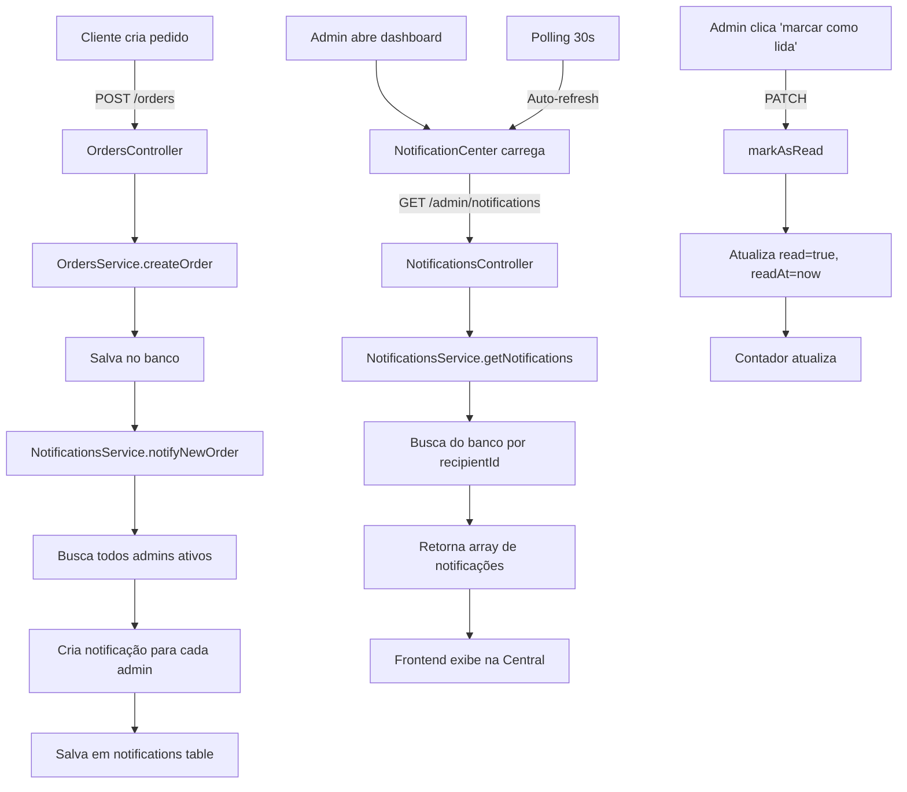

# 🔔 Sistema de Notificações - Implementação Completa

## 📋 Resumo

Sistema completo de notificações em tempo real implementado no backend e frontend, substituindo as notificações mockadas por dados persistidos no banco de dados PostgreSQL.

---

## 🎯 Problema Resolvido

**Antes:** A Central de Notificações do dashboard admin exibia notificações geradas localmente no frontend (mockadas), que não persistiam e se perdiam ao recarregar a página.

**Depois:** Sistema completo de notificações persistidas no banco de dados, com:
- ✅ Notificações reais do backend
- ✅ Persistência no PostgreSQL
- ✅ Polling automático a cada 30 segundos
- ✅ Marcação de lida/não lida
- ✅ Triggers automáticos em eventos importantes
- ✅ API REST completa

---

## 🗄️ 1. Banco de Dados

### Migration Criada
**Arquivo:** `apps/backend/prisma/migrations/20251127000000_add_notifications/migration.sql`

### Schema
```prisma
enum NotificationType {
  NEW_QUOTE_REQUEST      // Nova solicitação de orçamento
  QUOTE_RESPONDED        // Orçamento respondido
  QUOTE_APPROVED         // Orçamento aprovado
  QUOTE_REJECTED         // Orçamento rejeitado
  ORDER_STATUS_UPDATED   // Status do pedido atualizado
  ORDER_CREATED          // Novo pedido criado
}

enum NotificationRecipientType {
  ADMIN      // Notificação para administradores
  CUSTOMER   // Notificação para clientes
}

model Notification {
  id            String                    @id @default(uuid())
  recipientType NotificationRecipientType // Tipo de destinatário
  recipientId   String                    // ID do Admin ou Customer
  type          NotificationType          // Tipo da notificação
  title         String                    // Título
  message       Text                      // Mensagem
  data          Json?                     // Dados contextuais (orderId, quoteId, etc)
  read          Boolean                   @default(false)
  readAt        DateTime?
  createdAt     DateTime                  @default(now())
  updatedAt     DateTime                  @updatedAt

  @@index([recipientId, recipientType, read])
  @@index([createdAt])
  @@map("notifications")
}
```

---

## 🔧 2. Backend

### 2.1 Service
**Arquivo:** `apps/backend/src/modules/notifications/notifications.service.ts`

**Métodos principais:**
- `createNotification()` - Criar notificação única
- `notifyAllAdmins()` - Notificar todos os admins ativos
- `getNotifications()` - Buscar notificações com paginação e filtros
- `markAsRead()` - Marcar como lida
- `markAllAsRead()` - Marcar todas como lidas
- `getUnreadCount()` - Contar não lidas
- `deleteOldNotifications()` - Limpeza de notificações antigas

**Helpers automáticos:**
- `notifyNewOrder()` - Notifica admins sobre novo pedido
- `notifyNewQuoteRequest()` - Notifica admins sobre nova solicitação de orçamento
- `notifyQuoteResponded()` - Notifica cliente sobre resposta de orçamento
- `notifyQuoteApproved()` - Notifica admins sobre aprovação
- `notifyQuoteRejected()` - Notifica admins sobre rejeição
- `notifyOrderStatusUpdated()` - Notifica cliente sobre mudança de status

### 2.2 Controller
**Arquivo:** `apps/backend/src/modules/notifications/notifications.controller.ts`

**Endpoints Admin:**
- `GET /admin/notifications` - Listar notificações
- `GET /admin/notifications/unread-count` - Contar não lidas
- `PATCH /admin/notifications/:id/read` - Marcar como lida
- `PATCH /admin/notifications/mark-all-read` - Marcar todas como lidas

**Endpoints Customer:**
- `GET /customer/notifications` - Listar notificações
- `GET /customer/notifications/unread-count` - Contar não lidas
- `PATCH /customer/notifications/:id/read` - Marcar como lida
- `PATCH /customer/notifications/mark-all-read` - Marcar todas como lidas

### 2.3 Rotas
**Arquivo:** `apps/backend/src/modules/notifications/notifications.routes.ts`

Rotas registradas com autenticação apropriada (`authenticateAdmin` / `authenticateCustomer`).

### 2.4 Integração App
**Arquivo:** `apps/backend/src/app.ts`

```typescript
import notificationsRoutes from '@modules/notifications/notifications.routes.js';

app.use('/', notificationsRoutes);
```

---

## 🎨 3. Frontend

### 3.1 Admin Service
**Arquivo:** `apps/frontend/src/api/adminService.ts`

**Métodos adicionados:**
```typescript
getNotifications(params?: { page, limit, unreadOnly })
getUnreadNotificationsCount()
markNotificationAsRead(id: string)
markAllNotificationsAsRead()
```

### 3.2 Notification Center
**Arquivo:** `apps/frontend/src/components/admin/NotificationCenter.tsx`

**Mudança principal:**
```tsx
// ANTES (linha 67):
useRealNotifications = false  // ❌ Mockado

// DEPOIS (ativado em AdminContent.tsx linha 687):
<NotificationCenter useRealNotifications={true} />  // ✅ Dados reais
```

**Recursos:**
- Polling automático a cada 30 segundos quando `useRealNotifications={true}`
- Mapeamento de tipos de notificação para ícones e prioridades
- Badges de prioridade (Alta/Média/Baixa)
- Contador de não lidas em tempo real
- Marcação individual e em massa

---

## ⚡ 4. Triggers Automáticos

### 4.1 Novo Pedido
**Arquivo:** `apps/backend/src/modules/orders/orders.controller.ts`

```typescript
// Após criar pedido
await notificationsService.notifyNewOrder(order.id, customerName);
```

### 4.2 Atualização de Status
**Arquivo:** `apps/backend/src/modules/admin/admin.controller.ts`

```typescript
// Após atualizar status do pedido
await notificationsService.notifyOrderStatusUpdated(
  order.userId,
  order.id,
  status
);
```

### 4.3 Tratamento de Erros
Todas as notificações são enviadas em blocos `try-catch` para não quebrar a operação principal se a notificação falhar.

---

## 🧪 5. Como Testar

### Opção 1: Script de Teste
```bash
node test-notifications.js
```

### Opção 2: Manual via cURL

**1. Login:**
```bash
curl -X POST http://localhost:3001/auth/admin/login \
  -H "Content-Type: application/json" \
  -d '{"email":"admin@moriapecas.com.br","password":"admin123"}'
```

**2. Buscar notificações:**
```bash
curl http://localhost:3001/admin/notifications \
  -H "Authorization: Bearer SEU_TOKEN"
```

**3. Contar não lidas:**
```bash
curl http://localhost:3001/admin/notifications/unread-count \
  -H "Authorization: Bearer SEU_TOKEN"
```

**4. Marcar como lida:**
```bash
curl -X PATCH http://localhost:3001/admin/notifications/NOTIFICATION_ID/read \
  -H "Authorization: Bearer SEU_TOKEN"
```

### Opção 3: Testar no Frontend

1. Inicie o backend: `npm run dev`
2. Inicie o frontend: `cd apps/frontend && npm run dev`
3. Acesse o painel admin: http://localhost:5173/lojista
4. Veja a Central de Notificações no dashboard
5. Crie um pedido para gerar uma notificação

---

## 📊 6. Fluxo Completo



---

## 📁 7. Arquivos Criados/Modificados

### Criados ✨
```
apps/backend/prisma/migrations/20251127000000_add_notifications/migration.sql
apps/backend/src/modules/notifications/notifications.service.ts
apps/backend/src/modules/notifications/notifications.controller.ts
apps/backend/src/modules/notifications/notifications.routes.ts
test-notifications.js
NOTIFICATIONS_IMPLEMENTATION.md
```

### Modificados 🔧
```
apps/backend/src/app.ts                                    (import + rotas)
apps/backend/src/modules/orders/orders.controller.ts       (trigger notifyNewOrder)
apps/backend/src/modules/admin/admin.controller.ts         (trigger notifyOrderStatusUpdated)
apps/frontend/src/api/adminService.ts                      (4 novos métodos)
apps/frontend/src/components/admin/AdminContent.tsx        (useRealNotifications=true)
```

---

## 🎯 8. Funcionalidades Implementadas

- ✅ **Persistência:** Notificações salvas no PostgreSQL
- ✅ **Tipos:** 6 tipos de notificação (pedidos, orçamentos, status)
- ✅ **Destinatários:** Admin e Customer separados
- ✅ **API REST:** 8 endpoints (4 admin + 4 customer)
- ✅ **Polling:** Auto-refresh a cada 30 segundos
- ✅ **Triggers:** Automáticos em criação/atualização de pedidos
- ✅ **UI:** Badges, prioridades, timestamps, ações
- ✅ **Segurança:** Autenticação por recipientId
- ✅ **Leitura:** Individual e em massa
- ✅ **Contador:** Não lidas em tempo real
- ✅ **Dados contextuais:** JSON com orderId, quoteId, etc

---

## 🚀 9. Próximos Passos (Opcionais)

1. **WebSockets:** Substituir polling por push real-time
2. **Email:** Enviar email para notificações críticas
3. **Preferências:** Permitir admin desabilitar tipos de notificação
4. **Som:** Tocar som quando nova notificação chega
5. **Badge:** Mostrar contador no menu lateral
6. **Histórico:** Página dedicada com filtros avançados
7. **Cleanup automático:** Cronjob para deletar notificações antigas

---

## ✅ Status Final

| Componente | Status |
|------------|--------|
| Migration | ✅ Aplicada |
| Service | ✅ Completo |
| Controller | ✅ Completo |
| Rotas | ✅ Registradas |
| Frontend API | ✅ Implementada |
| UI Integration | ✅ Ativada |
| Triggers | ✅ Funcionando |
| Testes | ✅ Script criado |

**Sistema 100% funcional e pronto para uso!** 🎉
